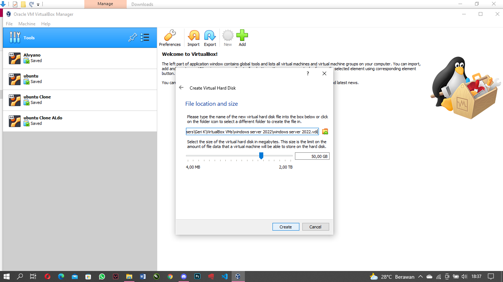
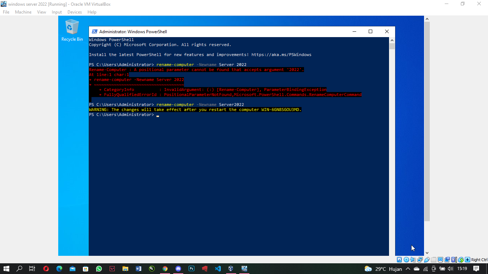
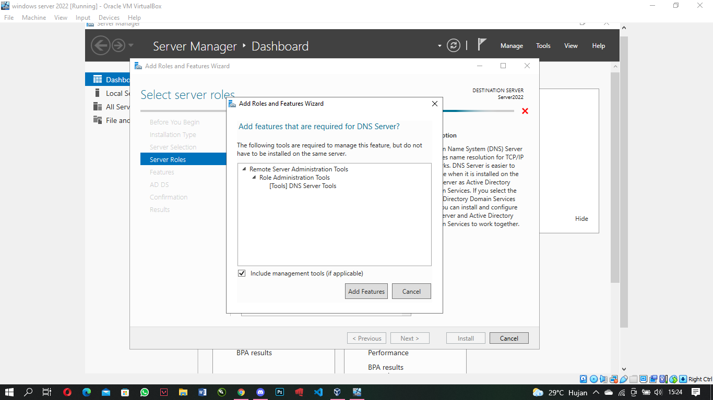
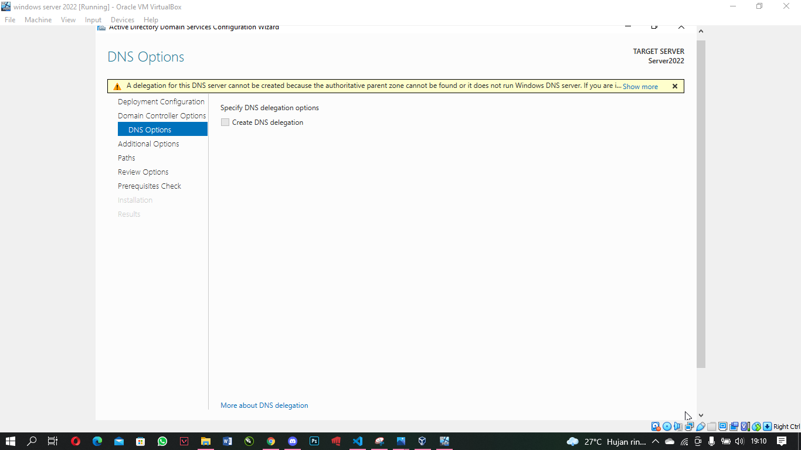

# UTS-Sistem Administrasi Server
Alvyano Rizqilla Riananta 1202190035 - IT0201
---
---
                            Question


Answer
---
---
```
A. Instalasi Windows Serever 2022
```
* Download ISO Installer Windows Server 2022

https://www.microsoft.com/en-us/evalcenter/evaluate-windows-server-2022

* Select download the ISO then follow it step by step.


* Open Oracle VM


* Then click New, and Enter the machine name and system type to use


* Define ram, create the disk defining type and size




* Go to the machine configuration and in the “Network” section set “Bridge adapter” 


* Click on Start and select the ISO downloaded


* Click on Start and the Windows Server 2022 installation wizard will load


* Click on Install now


* Select Windows Server 2022 desktop experience


* Accept the license and then proceed with the installation of Windows Server 2022


* Location installation of windows server 2022


* Installation Progress


* The system will reboot to complete the process


* Next, custom your password administrator


* Access the menu Input – Keyboard – Insert Ctrl + Alt + Del. Enter the password created and wait for the configuration to load


* Windows Server 2022 has been successfully installed


```
B. Instalasi Active Directory Domain Services
```
* Before doing the installation, we change the computer name first by going to windows powershell. Then type rename-computer -Newname Server2022

    * Open the start menu and select Windows PowerShell



* Then Restart, and openServer Manager


* Select menu manage, then add rules and features


* Select Next


* Select optionRole-based or feature-based installation. And next


* Click select a server from the server pool to select a local storage directory. Then next


* Next, put a check mark in the Active Directory Domain Services box. When you check the box, on the right appears a brief description of ADDS and how it works. Then click Add Features.


```
C. Instalasi DNS Server
```

* We need to install and configure the Active Directory role and DNS server to work together. Checklist DNS Servers then add features



```
D. Instalasi Net Framework 3.5
```
* Checklist .NET Framework 3.5 features


* Click Next


* Click Nextagain


* Select Install


* And Success


```
E. Promote Server to a Domain Controller
```

* Setting to static ip using cmd, type sconfig


* Choose Network Settings


* Setting the IP Address Server-ADDS and pointing the DNS to the static IP address used.


* Click Promote this server to a domain controller for ADD configuration


* Select Add a new forest and enter the domain name to be used in the Root Domain Name. For example here I use the domain Alvyano.com


* Select Windows Server 2016 at the functional level, put a check mark on Domain Name System (DNS) server and Global Catalog (GC). And fill in the Directory Services Restore Mode password with strong password criteria.


* Then click Next



* Fill in The NetBIOS domain name according to the domain name used.


* Skip the Paths section, click Next.


* Check the configuration specified in Review Options, if it is TRUE. Click Next.


* If there is All prerequisite checks passed successfully. Click Install to apply the specified configuration.


* After the installation is complete, the laptop will restart automatically. Then login using administrator password


* To check the configuration results, open cmd and type netdom query fsmo


* After logging in with the Active Directory Domain Controller, open the TCP/IP properties of your network connection. You can see the DNS server IP Address.


---
---
# FINISH 
